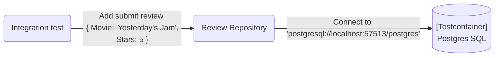
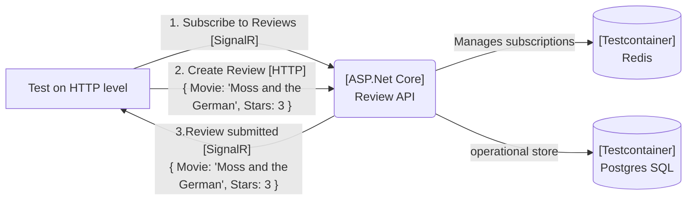

# What are Testcontainers?

The general idea of testcontainers is to build/start "throwaway" containers during test execution. Meaning you can have a database container per test class, test method or however you see fit within your strategy. 
Ultimately it's about choice and flexibility, you can run/start everything that has a docker image :D 
The original idea comes from the [Java ecosystem](https://www.testcontainers.org/)

Available .NET implementations: 
- [testcontainers dotnet](https://github.com/testcontainers/testcontainers-dotnet)
    seems not to get much of attention
- [*dotnet testcontainers](https://github.com/HofmeisterAn/dotnet-testcontainers)

Other approaches I didn't list? let me know! 

For my examples I'm using `*dotnet testcontainers` since
- it's an actively maintained project
- covers most of the functionality used e.g. expose ports, volume mounts, env vars etc.
- Already ships container builders for common databases e.g. redis, postgres
- I've used it several times, many thanks for that awesome piece of software ❤️

## What problems can Testcontainers solve

### Isolation

Your test "instance" has it's own container, typically as part of an integration test you're requiring some kind of external dependency e.g. a database. 

### Repeatable 

Works on my machine is something you won't hear anymore (at least if your not defeating it on purpose ;)
In addition the heavy lifting it "just" starting containers. Why because you'll instrument the container just as you would with your C# code e.g. Mocks or other test dependencies.

### Fast

In comparison to setups where you run the software yourself and do "backup/restore" or other trickery to get it to work.
Of course there is slight overhead to starting a container but on "modern" dev, ci machines this should be neglectable in comparison to the gains

## What Testcontainers don't do

- Orchestration, since it's just the plain infrastructure aspect you'll still need to think about data setup, port assignments etc.
- Parallelization, as the control is left to the user, you'll have to make up your mind if things can run in parallel or not. typical issues are volume mounts, host ports other shared resources.

## Practical examples

I've prepared a sample application that allows to submit movie reviews and get notified when a review your interessted was submitted, of course using Asp .Net Core and some other cool things ;)

[Source code on github](https://github.com/SbiCA/Testcontainers)

### Submit reviews for a given movie


The main idea of such a test is to validate if the your input end's up in the database correctly. 
In this case `postgresql://localhost:57513/postgres` the published port number of the container is randomly assigned and therefore differes.
 This behaviour can be changed but with static ports you'll limit the parallel test execution.


#### Implementation

I really like [Marten](https://github.com/JasperFx/marten) but that's worth another post. 
In short there is currently one issue with integration testing https://github.com/JasperFx/marten/issues/248 . In order to make sure you code does as it is supposed to you'll need a running `Postgres` instance.

So testcontainers to the rescue, let's setup some test data.

``` csharp
    public class ReviewRepositoryTests : IClassFixture<PostgreSqlFixture>
    {
        private const string MovieId = "The It crowd - yesterday's jam";
       
        private void GivenYesterdaysJam()
        {
            using var session = _documentStore.OpenSession();
            session.Store(new Review
            {
                Movie = MovieId
            });
            session.SaveChanges();
        }
    
```

For the test project setup I'm currently using XUnit with `ClassFixutures` but feel free to use other testing frameworks ;) 

``` csharp
      public class PostgreSqlFixture : IAsyncLifetime
      {
          private readonly PostgreSqlTestcontainer _testContainer;
  
          public PostgreSqlFixture()
          {
              var testContainerBuilder = new TestcontainersBuilder<PostgreSqlTestcontainer>()
                  .WithCleanUp(true) // remove container when fixture/test get's disposed
                  .WithDatabase(new PostgreSqlTestcontainerConfiguration
                  {
                      Database = "postgres",
                      Username = "postgres",
                      Password = "postgres"
                  })
                  .WithImage("clkao/postgres-plv8"); // use a different base image including plv8 plugin
  
              _testContainer = testContainerBuilder.Build();
          }
  
          public string ConnectionString => _testContainer.ConnectionString;
  
          public async Task InitializeAsync()
          {
              await _testContainer.StartAsync();
  
              // https://github.com/clkao/docker-postgres-plv8
              // this way you can enable plv8 for the fancy features of marten 🤩
              var result = await _testContainer.ExecAsync(new[]
              {
                  "/bin/sh", "-c",
                  "psql -U postgres -c \"CREATE EXTENSION plv8; SELECT extversion FROM pg_extension WHERE extname = 'plv8';\""
              });
          }
  
          public async Task DisposeAsync()
          {
              await _testContainer.StopAsync();
          }
      }
```

Now let's use the fixture in a very simple test

``` csharp

    public class ReviewRepositoryTests : IClassFixture<PostgreSqlFixture>
        {
            private const string MovieId = "The It crowd - yesterday's jam";
            private readonly DocumentStore _documentStore;
    
            public ReviewRepositoryTests(PostgreSqlFixture postgreSql)
            {
                _documentStore = ServiceCollectionExtensions.GetDocumentStore(postgreSql.ConnectionString);
            }
    
            [Fact]
            public async Task GivenLastJedi_WhenAddReview_ThenReviewAndMovieGotAdded()
            {
                GivenYesterdaysJam();
    
                var sut = new ReviewRepository(_documentStore);
    
                await sut.AddRating(MovieId, "me", 3);
    
                using var session = _documentStore.LightweightSession();
                var reviews = await session.LoadAsync<Review>(MovieId);
                var rating = reviews.Ratings.First();
                Assert.Equal(3, rating.Stars);
                Assert.Equal("me", rating.User);
            }
        }
```
So what does this test in short:
- Create a container instance of `PostgresSql` with activated `PLV8` plugin via `PostgresFixture`
- Get's a dedicated connecetion string to the randomly published port of the postgres container
- Initializes a document store instance with said connection string
- Insert & patches a review document to `It crowd - yesterdays jam`
- loads the document back from the db and assert's all went ok
- thorw away the container - ❤️


### Get realtime updates when a review got submitted
 
Using [SignalR with a redis backplane](https://docs.microsoft.com/en-us/aspnet/core/signalr/redis-backplane?view=aspnetcore-3.1),
 why would you ever do something as complicated as this? for example if you have more than one instance of your `Api`/`Hub host`, which doesn't seem that unrealistic IMHO. 



Let's look at how the setup of the dependencies takes place

``` csharp

 // in this case we take dependency on two test containers 
 public class End2EndTests : IClassFixture<PostgreSqlFixture>, IClassFixture<RedisFixture>, IDisposable
    {
        private const string MovieId = "It-Crowd";
        private readonly IWebHost _host;
        private readonly HttpClient _httpClient;
        private readonly HubConnection _signalRConnection;
        private readonly ITestOutputHelper _testOutputHelper;

        public End2EndTests(PostgreSqlFixture postgresFixture, RedisFixture redisFixture,
            ITestOutputHelper testOutputHelper)
        {
            _testOutputHelper = testOutputHelper;

            // Startup the api server use test server
            _host = WebHost.CreateDefaultBuilder()
                        .UseStartup<Startup>()
                        .UseTestServer()
                        .ConfigureTestServices(services =>
                        {
                            // add document store pointing to postgres testcontainer 👓
                            services.AddDocumentStore(postgresFixture.ConnectionString);
                            services.AddSignalR()
                                .AddJsonProtocol()
                                // add redis pointing to testcontainer 👓
                                .AddStackExchangeRedis(redisFixture.ConnectionString);
                        })
                        .Build();

            _host.Start();

            _httpClient = _host.GetTestClient();

            // setup the signalR connection to test server
            var httpMessageHandler = _host.GetTestServer().CreateHandler();
            _signalRConnection = new HubConnectionBuilder()
                .AddJsonProtocol()
                .WithUrl($"{_httpClient.BaseAddress}hubs/review",
                    options => { options.HttpMessageHandlerFactory = _ => httpMessageHandler; })
                .Build();
        }

        // .... to be continued 

```

Now let's see how we can everything glued together 

``` csharp

    public async Task GivenSubscriptionToItCrowd_WhenReviewGetsSubmitted_ThenReceivedTheRatingViaSignalR()
        {
            var ratingToSubmit = new AddRating
            {
                User = "sbica",
                Stars = 5
            };

            // subscribe to the movie using the 'ReviewHub'
            await GivenSubscription();

            // make sure we get notified if we get a new rating in
            AddRating receivedRating = null;
            var ratingReceived = new AutoResetEvent(false);
            _signalRConnection.On<AddRating>("NewRatingArrived", newRating =>
            {
                _testOutputHelper.WriteLine($"{newRating.User} rated {newRating.Stars}");
                receivedRating = newRating;
                ratingReceived.Set();
            });

            // subimt the rating
            await _httpClient.PostAsJsonAsync($"api/reviews/{MovieId}/ratings", ratingToSubmit);

            
            // wait for the arrival
            ratingReceived.WaitOne(TimeSpan.FromSeconds(2));
            receivedRating.Should().BeEquivalentTo(ratingToSubmit);
        }

        private async Task GivenSubscription()
        {
            await _signalRConnection.StartAsync();
            await _signalRConnection.InvokeAsync("SubscribeMovie", MovieId);
        }

```

# Summary


Testcontainers provide really great flexibity and isolation and when it comes to "tradtional" integration test with .Net the can change the picture quite a bit.
I hope this 'animation' of a water melon explotion experiment captures the gist of the concept of `Testcontainers` well enough (let me know :) )
Finally you can come up with arbitrary complicated test concepts but for me this **not** just another tool in my belt.  


