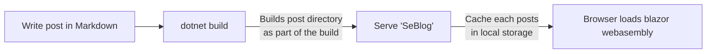

# Writing my first post


I seems that it took me quite a while but the release of  [Blazor wasm](https://devblogs.microsoft.com/aspnet/blazor-webassembly-3-2-0-now-available/) made me curious if I could build a static site blog with blazor :smile:

## The idea

Since I love writing in markdown and there are some awesome open source markdown parse such as [Markdig](https://github.com/lunet-io/markdig)



So inspired by `Yaml Front` I came to the idea to load the whole blog based on a directory and put all the required as part of the post.

``` yaml
---
title: Sample blog post
published: "06/01/2020 10:00:00"
description: What will be displayed 
---
# ... real blog content md content

```

This allows for a rather simple solution to build a `PostDirectory` with a simple list all files in the directory matching `*.md`
As of now am using a simple T4 for doing this later on I'll invest some time to have as part of the `dotnet build`.

``` t4
<#@ template language="C#" #>
<#@ import namespace="System.IO" #>
<#
    const string path = ".";
    var posts = Directory.GetFiles(path, "*.md", SearchOption.AllDirectories);

#>

namespace SeBlog.Posts
{
    using System.Collections.Generic;

    public static class PostLists
    {
        public static List<string> List = new List<string>
        {
<# // generate all posts
    foreach (var postPath in posts)
    {
#>
            "/posts/<#= Path.GetFileName(postPath) #>",
<#
    } #>
        };
    }
}
```
 Why do you need a list of all allowed blog posts? I wanted to make sure the client side only load what is intended to be loaded.
> Of course there are alternatives such as CSP etc. but this is an easy way without an impact on hosting

## Summary

I've you made all the way through you may have noticed ...


This is the actual blog engine this described above hosted on github pages :heart: and this blog is completely written in markdown

## next up and food for thought
- Extend blog categories, timeline and client side full text search 
- Msbuild instead of t4 for building blog list
- Automated deployment github actions or az devops
- Offline support and making it fully powered PWA
