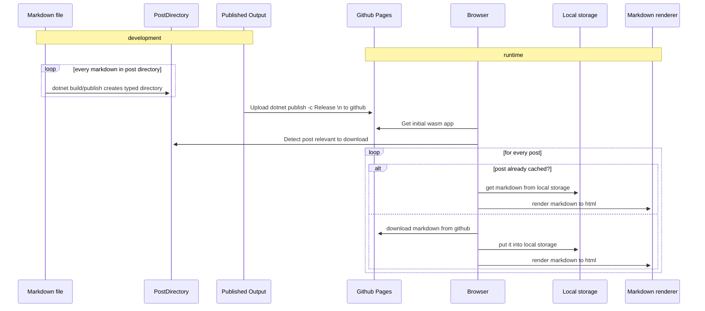

# Writing my first post

It seems that it took me quite a while and also multi tries to finally get started but the release of [Blazor wasm](https://devblogs.microsoft.com/aspnet/blazor-webassembly-3-2-0-now-available/) made me curious if I could build a static site blog with blazor :smile:

## The idea

Since I love writing in markdown and there are some awesome open source markdown parse such as [Markdig](https://github.com/lunet-io/markdig) I somehow thought wouldn't it be great if you can simply add a new `markdown` file (containing some meta-information) to a folder and it magically turns into a blog post. 
Besides my brain was trigger by the runtime capabilities of blazor to try and make it work offline and maybe some other features that can now finally be built leveraging existing .NET libraries (more on that at the end :) 


## How to get from a folder to servable html

### Building the list of posts
So inspired by `Yaml Front` I came to the idea to load the whole blog based on a directory and put all the required as part of the post.

``` yaml
---
title: Sample blog post
published: "06/01/2020 10:00:00"
description: What will be displayed 
---
# ... real blog content md content

```

This allows for a rather simple solution to build a `PostDirectory` with a simple list of all files in the directory matching `*.md`
As of now am using a simple T4 for doing this later on I'll invest some time to have as part of the `dotnet build`.

``` t4
<#
    // ...

    const string path = "wwwroot/posts";
    var postPaths = Directory.GetFiles(path, "*.md", SearchOption.AllDirectories);
    var titleToFile = new Dictionary<string, string>();
    foreach (var postPath in postPaths)
    {
        Console.WriteLine(postPath);
        var pathInWwwRoot = postPath.Replace("wwwroot", "");
        var postMarkdownContent = File.ReadAllText(postPath);
        var postKey = GetPostKeyFromYamlFront(postMarkdownContent);
        titleToFile.Add(postKey, pathInWwwRoot);
    }

    // ... 
#>

namespace SeBlog
{
    using System.Collections.Generic;

    public static class PostLists
    {
        public static Dictionary<string, string> TitleToFile = new Dictionary<string,string>
        {
<# // generate all posts
    foreach (var kvp in titleToFile)
    {
#>
            { "<#= kvp.Key #>","<#= kvp.Value #>"},
<#
    } #>
        };
    }
}
```
 Why do you need a list of all allowed blog posts? 
 I wanted to make sure the client side only loads what is intended to be loaded and no API is required.
 
 
 Of course, there are alternatives such as CSP or you could even use the GitHub content API but this is an easy way without any impact on hosting choice.

### rendering markdown to Html

Translating the markdown into a readable Html page is super easy thanks to [Markdig](https://github.com/lunet-io/markdig) and all the extensions it offers.

Here is a stripped down version of the rendering component code:

``` csharp
@using Markdig

@if (Markdown == null)
{
    <span>Loading...</span>
}
else
{
    @((MarkupString) BuildHtmlFromMarkdown(Markdown))
}

@functions {

    [Parameter]
    public string Markdown { get; set; }

    private string BuildHtmlFromMarkdown(string value)
    {
        var html = Markdig.Markdown.ToHtml(
            value,
            new MarkdownPipelineBuilder()
                .UseAdvancedExtensions()
                .UseYamlFrontMatter()
                .Build()
            );
        return html;
    }
}
```

### hosting it on GitHub pages

It seems I wasn't the only one crazy enough with that idea [Thx Andrea](https://dev.to/cirio/hosting-blazor-webassembly-app-on-github-pages-137k)

Just to briefly summaries what you'll need to do and maybe also why
- add a `.nojekyll` file  to your github GitHub repo
- in your `index.html` add a special javascript 
- add a `404.html`

These need to be added due to how GitHub pages serves files and params e.g. try to access a URL that doesn't exist as a file on GitHub pages

see the [github source](https://github.com/SbiCA/SeBlog)

## Summary

I've you made all the way through you may have noticed ... 


This is the actual blog engine described above hosted on github pages :heart: and this post is completely written in markdown 

To illustrate the current workflow this sequence diagram provides an overview of the current development & runtime process



## next up and food for thought

Here are some ideas where this approach could be taken
- Extend blog categories, timeline and client side full text search (hint Lucene.NET )
- MSBuild instead of t4 for building blog list?
- Automated deployment github actions or az devops
- Offline support and making it fully powered PWA
